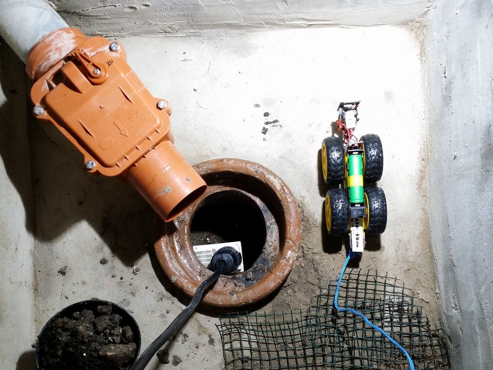
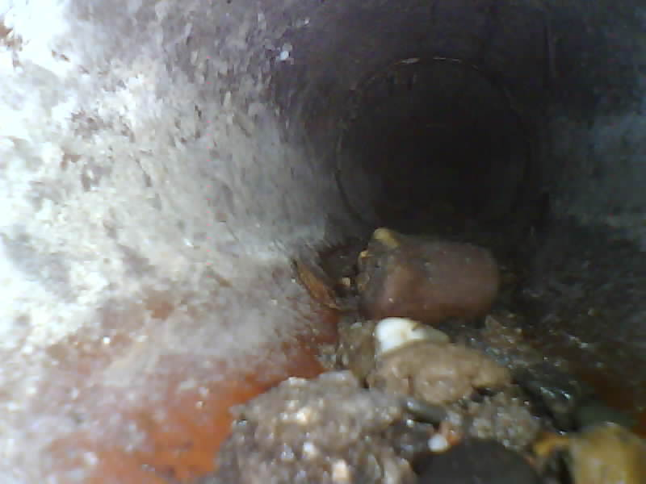

# [ESP32-Cam Sewer inspection car](https://github.com/ArminJo/ESP32-Cam-Sewer-inspection-car)

### [Version 1.0.0](https://github.com/ArminJo/ESP32-Cam-Sewer-inspection-car/archive/master.zip) - work in progress

Based on [esp32-cam-webserver](https://github.com/easytarget/esp32-cam-webserver/tree/master/src) by Owen Carter.

# Additional Features
- Pan servo for the ESP32-Cam.
- Go fixed distances.
- Adjustable speed / power.

### Features of Owen Carters version
- More options for default network and camera settings
- Save and restore settings
- Control of on-board lamps, rotate the view in the browser
- Dedicated standalone stream viewer
- Over The Air firmware updates
- Lots of minor fixes and tweaks, documentation etc.
- And 'reduced' by removing the Face Recognition features

# Pictures of the robot car
| | |
|-|-|
|  |  |
|  |  |
|  |  |
|  |  |
| Simple carrier glued to the servo | Connections at the TB6612FNG MosFet bridge breakout board |
|  | |
| Details of the 3.3 volt LDO regulator assembly | |

# Pictures of my sewer inspection
| | |
|-|-|
|  |  |
| The situation | The reason for this project (gravel in the sewer) |
|  |  |
| The discovery | After cleaning |
|  |  |
| Impressions | Impressions |
|  |  |
| End of the 125 mm sewer after 6 m |  |

# Revision History
### Version 1.0.0
- Initial version.

#### If you find this sketch useful, please give it a star.
